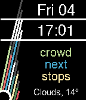

# Pebble-What3Words

A watchface for Pebble Smartwatch that displays your location according to
[What 3 Words](https://what3words.com/).

Compatible with every rectangular Pebble.




## Installing

[Get it from the Rebble Store](https://apps.rebble.io/en_US/application/63671421c6c24a000a815e48).

Or [Download the .pbw file](https://github.com/JavierRizzoA/Pebble-What3Words/releases)
in your phone and open it with the Pebble App.

## Configuration

The watchface is capable of displaying the current weather and temperature. This
option is off by default and in order to use it, it is necessary to supply an
[OpenWeatherMap API Key](https://openweathermap.org/api) in the settings.

## Building & Installing from Source

Edit the line `var W3W_KEY = '';` on `src/pkjs/index.js` so that it contains
your What3Words API key.

To compile and run on your Pebble, run the following commands:

```
pebble build

pebble install --phone [PHONE_IP_ADDRESS]
```

## Acknowledgements

* [/u/arminsson](https://www.reddit.com/user/arminsson), who [suggested making this watchface on reddit](https://www.reddit.com/r/pebble/comments/brfnib/request_a_what3words_watchface_would_be_amazing/).
* Morris, creator of a [similar watchface](https://gallery.fitbit.com/details/cb46bd1d-471b-4cf3-ac09-642ad780c7e6) for Fitbit.

## License

Copyright (C) 2022  Javier Rizzo-Aguirre

This program is free software: you can redistribute it and/or modify
it under the terms of the GNU General Public License as published by
the Free Software Foundation, either version 3 of the License, or
(at your option) any later version.

This program is distributed in the hope that it will be useful,
but WITHOUT ANY WARRANTY; without even the implied warranty of
MERCHANTABILITY or FITNESS FOR A PARTICULAR PURPOSE.  See the
GNU General Public License for more details.

You should have received a copy of the GNU General Public License
along with this program.  If not, see <https://www.gnu.org/licenses/>.
